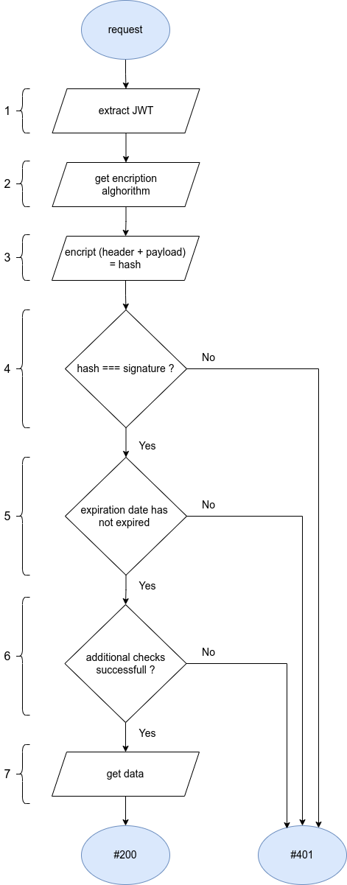
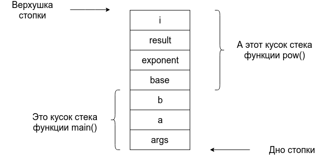
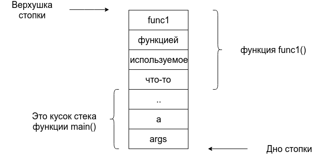
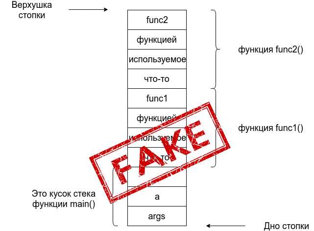
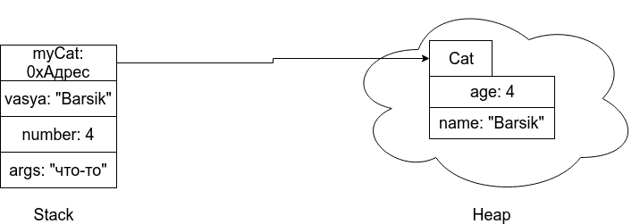
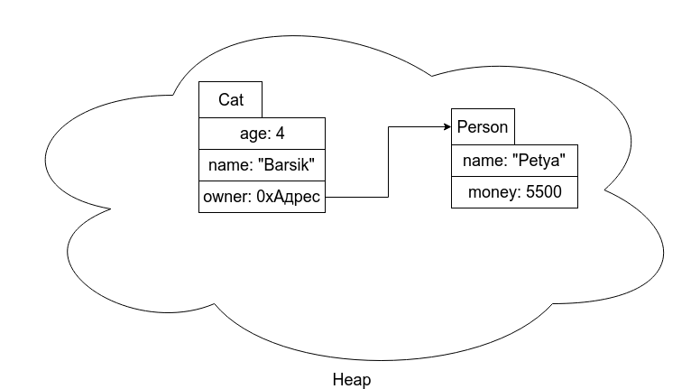

## <a name="ci_cd_pipeline"></a>CI/CD Pipeline

**CI/CD-пайплайн (CI/CD pipeline)** расшифровывается как «конвейер непрерывной интеграции и непрерывного развертывания».

Простыми словами — это особая практика автоматической доставки новых версий ПО пользователю на протяжении всего жизненного цикла разработки.

Все стадии пайплайна CI/CD:

%20pipeline.png>)

## <a name="unix-timestamp"></a>Что такое Unix-timestamp, какие проблемы решает, плюсы и минусы?

**Unix Timestamp, или метка времени,** – это способ представления времени в виде целого числа.

### Плюсы и минусы Unix Timestamp

#### Unix время обладает рядом преимуществ:

- **Экономия объема данных:** Unix Timestamp занимает всего 4 байта (в 32-битных системах), что меньше, чем большинство других форматов даты и времени.
- **Универсальность:** Unix время одинаково во всех часовых поясах, что упрощает работу с международными данными.

### Однако есть и недостатки:

- **Проблема 2038 года:** Ограничение 32-битных систем может привести к сбоям в работе старого программного обеспечения.
- **Читаемость:** Для человека Unix Timestamp не так интуитивно понятен, как обычные даты и время.

## <a name="process_vs_thread"></a>Чем отличается Процесс ОС от Потока ОС?

Главное отличие процессов от потоков, состоит в том, что процессы изолированы друг от друга и используют разные адресные пространства, а потоки, могут использовать одно и то же пространство (внутри процесса) при этом, выполняя действия не мешаяя друг другу.

1. Поток определяет последовательность исполнения кода в процессе.
2. Процесс ничего не исполняет, он просто служит контейнером потоков.
3. Потоки всегда создаются в контексте какого-либо процесса, и вся их жизнь проходит только в его границах.
4. Потоки могут исполнять один и тот же код и манипулировать одними и теми же данными, а также совместно использовать описатели объектов ядра, поскольку таблица описателей создается не в отдельных потоках, а в процессах.
5. Так как потоки расходуют существенно меньше ресурсов, чем процессы, в процессе выполнения работы выгоднее создавать дополнительные потоки и избегать создания новых процессов.

## <a name="lightweight_process"></a>Что такое легковесный поток (процесс)?

Операционная система создаёт процесс при запуске программы и внутри процесса создаёт первый поток ОС, в котором начинается выполнение кода. Потоки ОС создаются и управляются только операционной системой. В Go-программе, например, внутри процесса работает Go runtime — это часть программы, которая управляет выполнением кода. Go runtime при необходимости создаёт дополнительные потоки ОС и распределяет между ними выполнение. Легковесные потоки, такие как goroutine, создаются не операционной системой и не потоками ОС, а самим Go runtime в пользовательском пространстве. Для ОС goroutine не существуют: она видит только потоки ОС. Goroutine являются логическими единицами выполнения, которые runtime планирует и по своему усмотрению запускает на доступных потоках ОС; одна goroutine может выполняться на разных потоках ОС в разные моменты времени.

```Golang
ОС
 └─ создаёт процесс
     └─ создаёт поток ОС
         └─ запускается Go runtime
             ├─ создаёт потоки ОС (по необходимости)
             └─ создаёт goroutine (go func)
```

## <a name="http1_vs_http2_vs_http3"></a>Разница между http версий 1, 2, 3?

Главное отличие версий 2 и 3 от 1 - скорость: скорость загрузки страницы в браузере. Скорость установления соединения. Скорость обмена данными между сервером и страницей. Скорость обмена данными между сервисами/микросервисами.

### Блокировка соединения

**HTTP1 -> HTTP2**

Первая версия протокола `HTTP` требовала дожидаться получения ответа перед отправлением следующего запроса в рамках одного соединения (тут и происходит блокировка). Во второй версии протокола - соединение может использоваться без ожидания завершения уже отправленного запроса.

**HTTP2 -> HTTP3/QUIC**

Проблема блокировки была решена в версии 2 — но только на уровне `HTTP` протокола. На транспортном уровне `TCP` она все еще есть в виде обязательного последовательного получения пакетов. Поэтому версию 3 собрали на протоколе `UDP`, в которой этой особенности нет, и назвали это `QUIC`.

### Время на установление соединения

**HTTP1 -> HTTP2**

Для установления шифрованного соединения и обмена данными по `HTTP1` или `HTTP2` требуется от 2 до 3 рукопожатий: одно для `TCP` соединения и 1-2 для шифрования:

- В `HTTP1` каждое соединение требует отдельного набора рукопожатий, что может составлять от 2 до 18 рукопожатий, в зависимости от количества соединений.
- В `HTTP2` все сводится к одному соединению, что значительно сокращает количество необходимых рукопожатий до 2-3.

**HTTP2 -> HTTP3/QUIC**

В третьей версии обо всём хорошо подумали и рукопожатия свели к одному: в один запрос упаковали установление соединения и установление шифрования.

## <a name="grpc"></a>gRPC

Идея gRPC заключается в создании универсального механизма для эффективного и быстрого обмена данными между различными сервисами и приложениями, чем REST.

gRPC использует Protocol Buffers (ProtoBuf) — это бинарный формат данных, который подразумевает, что в сообщении вместо массива пар ключ-значение _(как это устроено в JSON, где пары ключ-значение можно писать в любом порядке)_ мы просто отправляем значения в установленном порядке. При этом оба участника сообщения имеют «под рукой» протоконтракт, который и позволяет определить, под каким порядковым номером идёт значение по тому или иному ключу.

```
message User {
	int32 id = 1;
	string name = 2;
	string email = 3;
 }
```

---

**Существует 4 способа использования gRPC:**

### Унарный (Unary)

Клиент отправляет один запрос и получает один ответ от сервера. Это похоже на обычный HTTP-запрос и ответ.

### Серверный стриминг (Server streaming)

Клиент отправляет один запрос и получает несколько ответов от сервера. Сервер может передавать ответы по мере их готовности, не дожидаясь запроса от клиента.

Используется, например, в приложениях для такси, где сервер может отправлять клиенту (водителю или пассажиру) обновления о геолокации.

### Клиентский стриминг (Client streaming)

Клиент отправляет несколько запросов и получает один ответ от сервера. Клиент может передавать запросы по мере их готовности, не дожидаясь подтверждения от сервера.

Используется, например, в сценариях, когда датчик транслирует температурные показатели.

### Двунаправленный стриминг (Bidirectional streaming)

Клиент и сервер могут отправлять и получать несколько сообщений в обоих направлениях. Сообщения могут отправляться и приниматься независимо, без строгого порядка. Это полезно в ситуациях, когда клиенту и серверу нужно вести непрерывный и динамический диалог или обмениваться данными в режиме реального времени.

Используется, например при создании чата в реальном времени или финансовые транзакции с изменением котировок.

---

**Подробнее можно почитать [ТУТЬ](https://habr.com/ru/companies/ozontech/articles/859936/)**

## <a name="jwt"></a>Как работает JWT?

`JWT (Json Web Token)` - ключ аутентификации пользователя. Используется для запросов к защищенным методам API. JWT состоит из 3 частей, разделенных точкой:


- **header** — содержит информацию об алгоритме шифрования и типе токена (JWT)

- **payload** — данные токена. Стандартные поля:

  - iss (Issuer) — издатель токена. Как правило — uuid приложения, выпустившего токен.

  - sub (Subject) — собственник токена. Как правило — uuid пользователя

  - aud (Audience) — массив url серверов, для которых предназначен токен

  - exp (Expiration Time) — время, в течение которого токен считается валидным.

  - nbf (Not Before) — временная метка, до которй токен не считается валидным

  - iat (Issued At) — время создания токена

  - jti (JWT ID) — уникальный идентификатор токена

- **signature** — строка, полученная из частей токена (header + payload) при помощи шифрования секретным ключом.

### Валидация токенов

Валидация состоит из нескольких этапов:



1. Извлекаем JWT из заголовка запроса

2. определяем алгоритм шифрования токена. (параметр “header.alg”)

3. при помощи алгоритма + секретный ключ шифруем:
   header + “.” + payload

4. сравниваем полученное значение с третьей частью токена (signature)
   Значения совпали? — идем дальше. Нет? — возвращаем на клиент #401

5. проверяем срок годности токена. (“payload.exp”)
   Срок не истек? — идем дальше.
   Истек? — возвращаем #401

6. дополнительно можно проверить остальные параметры payload: iss, sub, aud, nbf

7. отдаем на клиент запрошенные данные

### Black-list токенов

Когда мы выходим из учетной записи, или сбрасываем пароль, нам нужно отозвать ранее выданные токены. Для этого токены добавляются в специальный «черный список». При проверке токена мы сначала проверяем, не добавлен ли он в этот список, а затем уже валидируем его.

Чтобы токены не накапливались в «черном списке» их можно периодически удалять, но проще — использовать специальную базу данных с поддержкой TTL (Time to Live), например Redis.

### Контроль версий

#### Разберем ситуацию:

Ваши учетные данные были украдены.

Злоумышленник входит в приложение от вашего имени и получает пару токенов. Когда срок жизни токенов истекает, он запрашивает новые в обмен на refresh token, и т. д.

Вы узнаете, что страница взломана и сбрасываете пароль. Но, вы не можете отозвать все старые токены потому, что у вас их нет, они нигде не хранятся.

---

#### Чтобы решить эту проблему используют «контроль версий учетных данных»:

В таблицу нашей БД, где хранятся учетные данные, добавляем поле «version»

При создании refresh токена добавляем поле «version» в payload токена.

При каждой проверке refresh токена сверяем номер версии с номером из БД

Если номер версии не совпал, возвращаем #401

## <a name="api"></a>Что такое API?

API — это программный интерфейс, позволяющий отдельным приложениям взаимодействовать и обмениваться данными между собой.

Например, приложение доставки еды может использовать Google Maps API для отслеживания местоположения курьера.

## <a name="restful_api"></a>Что такое RESTful API?

RESTful API — это API, разработанный согласно принципам REST.

## <a name="main_rest_principles"></a>Основные принципы REST?

1. **Разделение на клиента и сервер:** Взаимодействие клиента и сервера осуществляется в виде запросов и ответов [(CRUD)](https://ru.wikipedia.org/wiki/CRUD).

2. **Единый протокол:** Взаимодействие между клиентом и сервером должны осуществляться по единому протоколу - HTTP.

3. **Бесстатусное состояние (Stateless) сервера:** Сервер не хранит никакой информации о прошлых запросах/ответах. Каждый запрос и ответ содержат всю информацию, необходимую для завершения взаимодействия. Бесстатусное взаимодействие снижает нагрузку на сервер, экономит память и повышает производительность.

4. **Многоуровневая система:** Возможны дополнительные серверы между клиентом и сервером API в виде слоев для выполнения различных функций.

5. **Кэшируемость:** Делается это в угоду повышения производительности.

## <a name="rest_vs_graphql"></a>REST vs GraphQL

[GraphQL](https://graphql.org/) - позволяет клиентам запрашивать только те данные, которые им нужны. Клиент определяет структуру и формат данных, которые он хочет получить.

Ключевая разница между REST и GraphQL в том, что REST имеет фиксированный формат запроса и ответа для каждого ресурса, а GraphQL нет.

## <a name="physical_vs_virtual_core"></a>Физическое и Виртуальное ядро: в чем отличия?

**Кратко:**

**Физическое ядро** — это реальный аппаратный «кусок» процессора на кристалле, а **виртуальное** (логическое) — это программное разделение или представление вычислительных ресурсов, которое выглядит как отдельное ядро, но работает поверх физического.

---

**Чуть глубже:**

**Физическое ядро** — это реальная вычислительная единица внутри CPU, которая выполняет инструкции и вычисления. 

Многопоточные и многоядерные процессоры содержат несколько таких ядер на одном чипе, каждое из которых может параллельно обрабатывать задачи.

**Логическое ядро** создаётся за счёт технологий типа Hyper‑Threading / SMT: одно физическое ядро «делится» на 2 и более потока, которые ОС видит как отдельные процессоры.

Эти **логические ядра** используют одни и те же аппаратные ресурсы (кэш, исполнительные блоки), поэтому их суммарная производительность меньше, чем у такого же количества независимых физических ядер.

## <a name="inter_thread_communication"></a>Виды межпоточного взаимодействия

- CSP (Communicating Sequential Processes) — это модель параллелизма в Go, позволяет разбивать программу на независимые процессы (горутины), общающиеся через каналы вместо общего доступа к памяти. Ключевые элементы: горутины, каналы, селекты

- Общая память (shared memory) — потоки общаются через мутабельные переменные и мьютексы

| Аспект        | Shared Memory (threads)        | CSP (Go goroutines + channels)                   |
| ------------- | ------------------------------ | ------------------------------------------------ |
| Обмен данными | Через общие переменные + locks | Через каналы (копии сообщений)             |
| Риски         | Race conditions, deadlocks     | Минимальны, синхронизация встроена     |
| Масштаб       | Ограничен overhead потоков     | Тысячи легковесных горутин​ |
| Код           | Сложный, с мьютексами          | Простой, декларативный​      |

## <a name="identification_authentication_authorization"></a>Идентификация, Аутентификация, Авторизация

- **Идентификация** — система пытается понять, кто ты.
Пример: ты заходишь на сайт и вводишь логин или имя пользователя.

   *Система на этом этапе узнаёт: «ага, это пользователь с именем ivan123».
   Но она ещё не уверена, что действительно это ты — просто знает, кто пытается войти.*

- **Аутентификация** — система проверяет, что ты действительно тот, за кого себя выдаёшь.
Пример: ты вводишь пароль, и система сверяет его с тем, что хранится в базе.
   
   *Если совпадает — значит, ты действительно ivan123.
   Если нет — значит, кто-то пытается войти под чужим именем.*

- **Авторизация** — система решает, что тебе разрешено делать.
Пример: если ты вошёл как обычный пользователь, тебе можно читать сообщения, но нельзя удалять чужие.
А если ты администратор — тебе можно и удалять, и редактировать.

   *Авторизация определяет права и возможности после успешной аутентификации.*


## <a name="stack_and_heap"></a>Стек и куча для чайников

Обычно всё начинается с простого вопроса: «Что хранится в стеке, а что в куче?».

Во-первых, при рассмотрении этой проблемы нужно понимать, что и стек, и куча служат для хранения данных программы.

Давайте рассмотрим пример простой программы и определим, какие вообще бывают данные.

```java
public class App {
 public static void main(String[] args) {
     System.out.print("Введите a:");
     int a = Integer.parseInt(System.console().readLine());
     System.out.print("Введите b:");
     int b = Integer.parseInt(System.console().readLine());
     System.out.println("a+b=" + pow(a,b));
 }
 public static Long pow(int base, int exponent) {
     Long result = 1L;
     for (int i = 0; i < exponent; i++) {
          result *= base;
     }
     return result;
 }
}
```

Программа выше читает с консоли числа `a` и `b` и возводит `a` в степень `b`. Что же в этой программе является данными? Очевидно — переменные, объявленные в коде. У нас есть переменные `a`, `b`, `result`. Но как теперь понять, что и где хранится, и что вообще такое стек и куча?

Для этого рассмотрим ещё один важный термин — **область видимости**. У каждой переменной она своя. При росте сложности программы возникает необходимость разбивать её на структурные единицы, что позволяет снизить общую сложность. Также можно выделять повторяющиеся блоки кода и использовать их в разных местах.

В языках программирования для таких ситуаций существуют именованные блоки кода, которые называют функциями или процедурами. Такие блоки выполняют определенную логическую последовательность действий и могут работать с разными данными. В примере выше мы вынесли блок кода, отвечающий за возведение числа в степень, в отдельную функцию. Для того чтобы функции могли выполняться над разными данными, существует понятие **аргументов**. Как видно из примера, объявленная функция `pow` должна получать на вход два целочисленных аргумента: первое значение будет использоваться как основание, а второе — как степень.

Теперь можно дополнить список того, что мы зовем данными в программе: `a, b, result, base, exponent`.

Вернёмся к понятию области видимости. У каждой переменной есть определенная область, внутри которой её «видно», а также своё время жизни. У каждой программы есть свой поток исполнения. Например, в коде выше сначала считаются два значения, затем выполнится функция `pow`, а её результат выведется на консоль. Переменные должны где-то храниться, чтобы в нужный момент их значения можно было прочитать или изменить. Очевидно, что они должны находиться в оперативной памяти компьютера. Важно, чтобы когда переменная больше не нужна, занимаемое ей место освобождалось, иначе в какой-то момент память просто закончится.

### Стек (Stack)

Теперь перейдем к рассмотрению понятия **стек**. По сути, под стеком подразумевается определенный принцип хранения и обращения к данным. Хорошим примером стека является стопка тарелок. К ней применимы две операции: положить новую тарелку наверх стопки или взять верхнюю тарелку. Этими действиями организуется принцип **LIFO** (Last In — First Out: «последним пришёл — первым ушёл»).

Происходит это следующим образом: как только программа начинает выполнять какую-то функцию, под используемые в ней переменные выделяется место в стеке. Например, при старте нашей программы в стеке будет выделено место под переменные `args`, `a`, `b`. По мере выполнения функции ячейки в стеке будут заполняться значениями. В тот момент, когда программа дойдет до вызова функции `pow`, в стеке создастся место под переменные, необходимые для этой функции. С некоторыми упрощениями стек будет выглядеть следующим образом:



Как видно из примера, у каждой функции есть свой «кусочек» стека. Когда функция обращается к переменным, за этими именами стоят конкретные места в её собственном сегменте стека (их обычно называют **кадрами** или **фреймами**).

Первое, на что нужно обратить внимание: аргументы функции (`base`, `exponent`) занимают отдельные места в памяти. Может показаться, что раз мы передаем в функцию `pow` переменные `a` и `b`, то внутри неё мы будем работать с теми же ячейками стека. Это мнение ошибочно. Код вызываемой функции (`pow`) не может менять переменные вызывающей функции (`main`). Поэтому, когда исполнение доходит до строки с вызовом `pow(a, b)`, значения из соответствующих мест копируются в ячейки, выделенные под `base` и `exponent`. В момент, когда внутренняя функция завершает работу, место в стеке, использованное под неё, очищается и может быть использовано повторно — например, для вызова следующей функции.

Рассмотрим это на примере:

```java
public class App {
   public static void main(String[] args){
       int a = 3;
       int b = 4;
       int c = func1(a, b);    
       c++;
       d = func2(c, a);
   }
}
```

Здесь есть функция `main()`, в которой последовательно вызываются `func1` и `func2`.

Предположим, что в данный момент программа находится внутри `func1` и производит вычисления. В это время стек будет иметь следующий вид:



Очень важно понимать, что в этот момент в стеке нет ничего, что относится к функции `func2`. Когда мы войдем в `func2`, часть стека, использовавшаяся под `func1`, будет уже стерта, а на её месте расположится кадр `func2`.




Первое изображение было бы верным, если бы `func2` вызывалась *внутри* `func1`. Вообще, когда на стеке лежит $N$ кадров, это означает, что мы находимся на глубине $N$: выполнение находится в функции `funcN`, которая была вызвана другой функцией, а та — следующей и так далее. Когда `funcN` выполнится, её кадр удалится из стека, и управление вернется к вызывающей функции. Так, по ходу работы программы, стек будет то «углубляться», получая новые кадры, то «раскручиваться» назад, удаляя их.

**Итог по стеку:** в стеке хранятся данные, относящиеся к контексту функций, которые выполняются в данный момент. К ним относятся локальные переменные, аргументы функции, адрес возврата и, возможно, возвращаемое значение.

### Куча (Heap)

А зачем нужна **куча (heap)**?

Представим ситуацию, когда мы обрабатываем не просто числа, а сложные структуры. Например, мы определили структуру «Человек», которая состоит из строки (имя) и числа (возраст). Если нам нужно передать в функцию информацию о конкретном человеке, придется копировать уже два значения. Это похоже на то, как копировались `a` и `b` в примере выше. Однако иногда данных становится слишком много. Если копировать их часто, возникнут большие накладные расходы как по времени, так и по памяти.

Для решения этой проблемы была создана отдельная область памяти — **куча**. Куча предназначена для хранения долгоживущих объектов (например, информации о людях или котиках).

Рассмотрим пример на Java:

```java
class Cat {
   String name;
   int age;
}
 
class App {
   public static void main(String[] args) {
      int number = 4;
      String vasya = "Барсик";
      Cat myCat = new Cat(vasya, number);
   }
}
```

В этом коде мы объявили класс (структуру), описывающий кота. В функции `main` мы создали несколько переменных и новый объект кота.

Инструкция `new Cat` создает объект, который будет храниться в куче. Объекты в куче создаются динамически во время работы программы. Каждый такой объект располагается по определенному адресу. Этот адрес нужно где-то хранить, чтобы программа знала, где искать данные кота. Сам адрес (ссылка) будет храниться в стеке под именем переменной `myCat`.

Выглядеть это будет примерно так:



Как видно на картинке, стек хранит адрес объекта, находящегося в куче. Теперь, если нам нужно передать кота в другую функцию, мы просто скопируем его адрес в стек этой функции. Таким образом, одни переменные хранят само значение, а другие — адрес.

Для полноты картины представим, что у кота появилась информация о владельце (имя и количество денег). Тогда куча будет выглядеть следующим образом:



Этот пример иллюстрирует важную вещь: адрес объекта не всегда хранится в стеке. В нашем случае «Владелец» — это часть информации о коте. Если кот хранится в куче, то и ссылка на его владельца хранится там же. При этом, так как «Человек» — ссылочный тип данных, он тоже лежит в куче, а у кота есть лишь ссылка на него. Ошибочно полагать, что все данные о человеке будут находиться в том же блоке памяти, что и данные кота.

Также неверно считать, что если переменная имеет примитивный тип, она обязательно лежит в стеке. Возраст является частью объекта `Cat`, поэтому он находится в куче вместе с остальной информацией о коте. При этом там записано само значение `4`, а не адрес, указывающий на другое место.

### Общий итог

В **стеке** хранится контекст исполняемых функций: их локальные переменные, аргументы, адрес возврата и возвращаемое значение. В зависимости от типа переменной (ссылочный или примитивный), в стеке лежат либо сами значения, либо адреса объектов в куче.

В **куче** хранятся все объекты (ссылочные типы данных). Если объект содержит поле примитивного типа, то само значение хранится внутри блока памяти этого объекта. Если же объект содержит поле ссылочного типа, то внутри него хранится адрес, указывающий на другое место в куче, где находятся данные этого вложенного объекта.