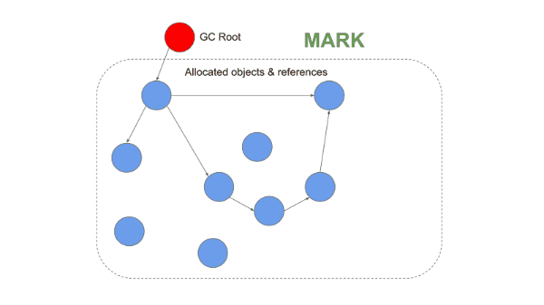
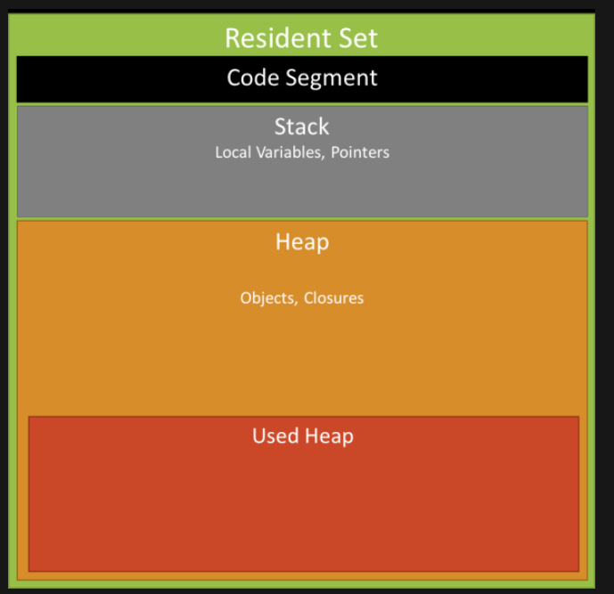
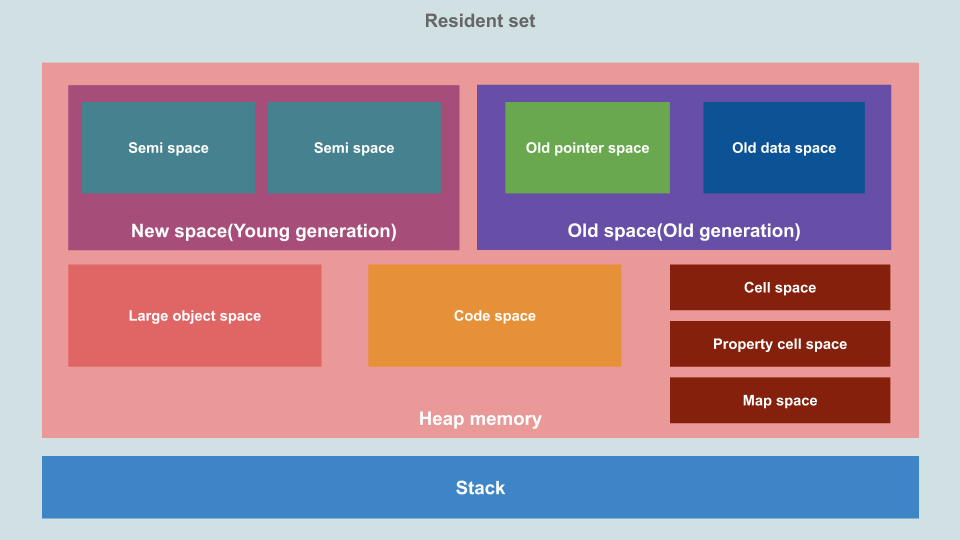
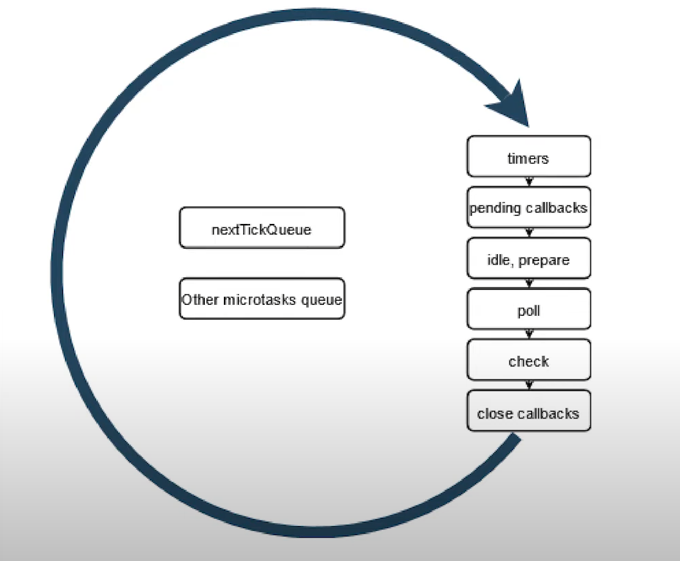

## Сборщик мусора (Garbage Collector) в V8

Принцип сборки мусора довольно прост: если на сегмент в памяти никто не ссылается, например на объект, можно считать, что он (объект) не используется, и очистить его. Такой принцип ещё называют [принципом достижимости](https://learn.javascript.ru/garbage-collection#dostizhimost).

Основной алгоритм сборки мусора называется [mark-and-sweep](https://ru.wikipedia.org/wiki/%D0%A1%D0%B1%D0%BE%D1%80%D0%BA%D0%B0_%D0%BC%D1%83%D1%81%D0%BE%D1%80%D0%B0). Этот алгоритм может быть объединен также и с алгоритмом [mark-compact](https://en.wikipedia.org/wiki/Mark%E2%80%93compact_algorithm). Вместе они работают следующим образом:

1. Сборщик мусора отмечает все корневые объекты.
2. Далее помечаются все объекты, на которые ссылаются эти корни.
3. Процесс повторяется для всех достижимых объектов.
4. После этого непомеченные объекты считаются недостижимыми и удаляются.
5. Происходит перемещение (дефрагментация) оставшихся объектов. Это уменьшит фрагментацию и повысит производительность выделения памяти для новых объектов.

 

Существует ещё несколько алгоритмов сборки мусора. Некоторые из наиболее распространенных алгоритмов включают:

1. [Serial Garbage Collector](https://proselyte.net/jvm-basics/#gc-sgc)
2. [Parallel Garbage Collector](https://proselyte.net/jvm-basics/#gc-pgc)
3. [Concurrent Mark and Sweep (CMS)](https://proselyte.net/jvm-basics/#gc-cms)
4. [Garbage First (G1)](https://proselyte.net/jvm-basics/#gc-g1)

---

Копнем ещё чуть глубже. Как вообще распределяются в памяти переменные, функции и объекты? V8 использует схему, основанную на концепции Java Virtual Machine [(JVM)](https://proselyte.net/jvm-basics/) и делит память на сегменты:

 

-   **Code**: выполняемый на данный момент код.
-   **Stack** (статическое выделение памяти): содержит все примитивные типы данных (вроде int, bool, string и тд) с указателями на функции, объекты, а также информация о вызовах методов.
-   **Heap** (динамическое выделение памяти): сегмент памяти, предназначенный для хранения ссылочных типов данных, вроде объектов, массивов и функций. Это самый большой блок области памяти и именно здесь происходит сборка мусора.

---

Вы готовы, дети? Мы погружаемся ещё глубже.

**Stack:**

Это область памяти, выделенная для каждого процесса в V8. Здесь, как говорилось ранее, хранятся статические данные, включая фреймы методов/функций, примитивные значения и указатели на объекты. Стек работает по принципу [LIFO (Last In, First Out)](https://ru.wikipedia.org/wiki/LIFO), то есть последний добавленный элемент будет первым извлеченным.

**Heap** – самый большой блок области памяти, под капотом он делиться на:

 

-   **Young generation** - место, где "живут" новые объекты, и большинство из них недолговечны. Это пространство небольшое и состоит из двух полу-пространств.
-   **Old generation** - место, куда перемещаются объекты, которые пережили два цикла сборки мусора в **Young generation** блоке. Это пространство управляется основным алгоритмом сборки мусора _mark-and-sweep_. **Old generation** можно поделить ещё на два подпространства:
    -   **Old pointer space** - cодержит объекты, которые пережили два цикла сборки мусора, и имеют указатели на другие объекты.
    -   **Old data space** – содержит исключительно объекты, которые имеют данные (без ссылок) и строки, числа, массивы.
-   **Large object space** – тут хранятся объекты, размер которых превышает размер других пространств. _Большие объекты никогда не удаляются сборщиком мусора._
-   **Code-space** - Здесь Just In Time [(JIT)](https://habr.com/ru/companies/oleg-bunin/articles/417459/) компилятор сохраняет скомпилированные блоки кода. Это единственное пространство с исполняемой памятью.
-   **Cell space, property cell space, and map space** – тут хранятся сервисные объекты, которые упрощают сборку мусора.

## Event loop в Node.js

Event loop – это цикл событий и он бесконечен до тех пор, пока есть что выполнять. Event loop делиться на несколько фаз (6 фаз):

 

-   1 фаза – `таймеры`. Тут выполняются `setTimeout`, `setInterval`
-   2 фаза – `I/O-callback’и`. Например, чтение и запись файла, работа с соединением к сети.
-   3 фаза – `ожидание, подготовка`. На эту фазу мы никак не можем повлиять, но Event loop может сам туда попасть, например перед тем, как начинает читать файл.
-   4 фаза – `опрос`. Именно сюда попадает JavaScript код и именно здесь нода может быть заблокирована.
-   5 фаза – `проверка`. Выполняются колбэки `setImmediate`.
-   6 фаза – `закрытие соединений`. Например, у вебсокета есть соединение, его нужно как-то отключить – именно здесь вызывается колбэк по его отключению.

И также есть две приоритетные очереди (я не знаю, какое у них официальное название, я назвал их так):

-   `nextTickQueue`. Тут выполняютс все `process.nextTick()`.
-   `microtasks`. Сюда попадают `then` у промисов.

---

Как это работает? Перед входом в фазу или перед выходом из фазы Event loop выполняет все приоритетные очереди, потом опять бежит по фазам и так по кругу, пока есть что выполнять.

Посмотреть лучшую лекцию Сергея Аванесяна, как работает Event loop в Node.js можно [тут](https://www.youtube.com/watch?v=7f787SsgknA).

## CI/CD Pipeline

**CI/CD-пайплайн (CI/CD pipeline)** расшифровывается как «конвейер непрерывной интеграции и непрерывного развертывания».

Простыми словами — это особая практика автоматической доставки новых версий ПО пользователю на протяжении всего жизненного цикла разработки.

Все стадии пайплайна CI/CD:

%20pipeline.png>)

## Что такое Unix-timestamp, какие проблемы решает, плюсы и минусы?

**Unix Timestamp, или метка времени,** – это способ представления времени в виде целого числа.

### Плюсы и минусы Unix Timestamp

#### Unix время обладает рядом преимуществ:

-   **Экономия объема данных:** Unix Timestamp занимает всего 4 байта (в 32-битных системах), что меньше, чем большинство других форматов даты и времени.
-   **Универсальность:** Unix время одинаково во всех часовых поясах, что упрощает работу с международными данными.

### Однако есть и недостатки:

-   **Проблема 2038 года:** Ограничение 32-битных систем может привести к сбоям в работе старого программного обеспечения.
-   **Читаемость:** Для человека Unix Timestamp не так интуитивно понятен, как обычные даты и время.

## Чем отличается Process от Thread?

1. Поток определяет последовательность исполнения кода в процессе.
2. Процесс ничего не исполняет, он просто служит контейнером потоков.
3. Потоки всегда создаются в контексте какого-либо процесса, и вся их жизнь проходит только в его границах.
4. Потоки могут исполнять один и тот же код и манипулировать одними и теми же данными, а также совместно использовать описатели объектов ядра, поскольку таблица описателей создается не в отдельных потоках, а в процессах.
5. Так как потоки расходуют существенно меньше ресурсов, чем процессы, в процессе выполнения работы выгоднее создавать дополнительные потоки и избегать создания новых процессов.

Главное отличие процессов от потоков, состоит в том, что процессы изолированы друг от друга и используют разные адресные пространства, а потоки, могут использовать одно и то же пространство (внутри процесса) при этом, выполняя действия не мешаяя друг другу.

## Разница между http версий 1, 2, 3?

Главное отличие версий 2 и 3 от 1 - скорость: скорость загрузки страницы в браузере. Скорость установления соединения. Скорость обмена данными между сервером и страницей. Скорость обмена данными между сервисами/микросервисами.

### Блокировка соединения

**HTTP1 -> HTTP2**

Первая версия протокола `HTTP` требовала дожидаться получения ответа перед отправлением следующего запроса в рамках одного соединения (тут и происходит блокировка). Во второй версии протокола - соединение может использоваться без ожидания завершения уже отправленного запроса.

**HTTP2 -> HTTP3/QUIC**

Проблема блокировки была решена в версии 2 — но только на уровне `HTTP` протокола. На транспортном уровне `TCP` она все еще есть в виде обязательного последовательного получения пакетов. Поэтому версию 3 собрали на протоколе `UDP`, в которой этой особенности нет, и назвали это `QUIC`.

### Время на установление соединения

**HTTP1 -> HTTP2**

Для установления шифрованного соединения и обмена данными по `HTTP1` или `HTTP2` требуется от 2 до 3 рукопожатий: одно для `TCP` соединения и 1-2 для шифрования:

-   В `HTTP1` каждое соединение требует отдельного набора рукопожатий, что может составлять от 2 до 18 рукопожатий, в зависимости от количества соединений.
-   В `HTTP2` все сводится к одному соединению, что значительно сокращает количество необходимых рукопожатий до 2-3.

**HTTP2 -> HTTP3/QUIC**

В третьей версии обо всём хорошо подумали и рукопожатия свели к одному: в один запрос упаковали установление соединения и установление шифрования.
