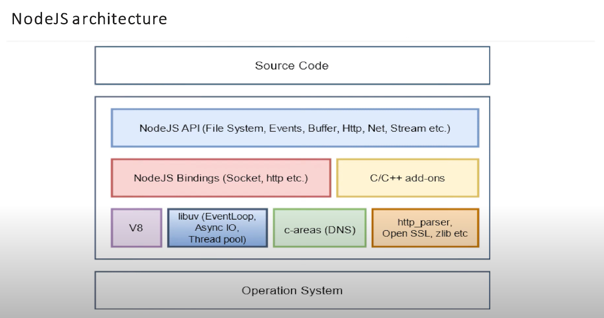

## <a name="GC"></a>Сборщик мусора (Garbage Collector) в V8

Принцип сборки мусора довольно прост: если на сегмент в памяти никто не ссылается, например на объект, можно считать, что он (объект) не используется, и очистить его. Такой принцип ещё называют [принципом достижимости](https://learn.javascript.ru/garbage-collection#dostizhimost).

Основной алгоритм сборки мусора называется [mark-and-sweep](https://ru.wikipedia.org/wiki/%D0%A1%D0%B1%D0%BE%D1%80%D0%BA%D0%B0_%D0%BC%D1%83%D1%81%D0%BE%D1%80%D0%B0). Этот алгоритм может быть объединен также и с алгоритмом [mark-compact](https://en.wikipedia.org/wiki/Mark%E2%80%93compact_algorithm). Вместе они работают следующим образом:

1. Сборщик мусора отмечает все корневые объекты.
2. Далее помечаются все объекты, на которые ссылаются эти корни.
3. Процесс повторяется для всех достижимых объектов.
4. После этого непомеченные объекты считаются недостижимыми и удаляются.
5. Происходит перемещение (дефрагментация) оставшихся объектов. Это уменьшит фрагментацию и повысит производительность выделения памяти для новых объектов.

</br>


Существует ещё несколько алгоритмов сборки мусора. Некоторые из наиболее распространенных алгоритмов включают:

1. [Serial Garbage Collector](https://proselyte.net/jvm-basics/#gc-sgc)
2. [Parallel Garbage Collector](https://proselyte.net/jvm-basics/#gc-pgc)
3. [Concurrent Mark and Sweep (CMS)](https://proselyte.net/jvm-basics/#gc-cms)
4. [Garbage First (G1)](https://proselyte.net/jvm-basics/#gc-g1)

---

Копнем ещё чуть глубже. Как вообще распределяются в памяти переменные, функции и объекты? V8 использует схему, основанную на концепции Java Virtual Machine [(JVM)](https://proselyte.net/jvm-basics/) и делит память на сегменты:

</br>


- **Code**: выполняемый на данный момент код.
- **Stack** (статическое выделение памяти): содержит все примитивные типы данных (вроде int, bool, string и тд) с указателями на функции, объекты, а также информация о вызовах методов.
- **Heap** (динамическое выделение памяти): сегмент памяти, предназначенный для хранения ссылочных типов данных, вроде объектов, массивов и функций. Это самый большой блок области памяти и именно здесь происходит сборка мусора.

---

Вы готовы, дети? Мы погружаемся ещё глубже.

**Stack:**

Это область памяти, выделенная для каждого процесса в V8. Здесь, как говорилось ранее, хранятся статические данные, включая фреймы методов/функций, примитивные значения и указатели на объекты. Стек работает по принципу [LIFO (Last In, First Out)](https://ru.wikipedia.org/wiki/LIFO), то есть последний добавленный элемент будет первым извлеченным.

**Heap** – самый большой блок области памяти, под капотом он делиться на:

</br>


- **Young generation** - место, где "живут" новые объекты, и большинство из них недолговечны. Это пространство небольшое и состоит из двух полу-пространств.
- **Old generation** - место, куда перемещаются объекты, которые пережили два цикла сборки мусора в **Young generation** блоке. Это пространство управляется основным алгоритмом сборки мусора _mark-and-sweep_. **Old generation** можно поделить ещё на два подпространства:
  - **Old pointer space** - cодержит объекты, которые пережили два цикла сборки мусора, и имеют указатели на другие объекты.
  - **Old data space** – содержит исключительно объекты, которые имеют данные (без ссылок) и строки, числа, массивы.
- **Large object space** – тут хранятся объекты, размер которых превышает размер других пространств. _Большие объекты никогда не удаляются сборщиком мусора._
- **Code-space** - Здесь Just In Time [(JIT)](https://habr.com/ru/companies/oleg-bunin/articles/417459/) компилятор сохраняет скомпилированные блоки кода. Это единственное пространство с исполняемой памятью.
- **Cell space, property cell space, and map space** – тут хранятся сервисные объекты, которые упрощают сборку мусора.

## <a name="event_loop_node"></a>Event loop в Node.js

Event loop – это цикл событий и он бесконечен до тех пор, пока есть что выполнять. Event loop делиться на несколько фаз (6 фаз):

</br>

- 1 фаза – `таймеры`. Тут выполняются `setTimeout`, `setInterval`. _Таймер указывает на минимальный интервал времени, после которого **МОЖЕТ** быть выполнен переданный ему callback, а не точное время выполнения._ Обратные вызовы таймеров выполняются как можно раньше после истечения времени, но их выполнение может быть задержано из-за работы операционной системы или выполнения других callback'ов.

- 2 фаза – `I/O-callback’и`. Например, чтение и запись файла, работа с соединением к сети.

- 3 фаза – `ожидание, подготовка`. На эту фазу мы никак не можем повлиять, но Event loop может сам туда попасть, например перед тем, как начинает читать файл.

- 4 фаза – `опрос`. Когда цикл обработки событий входит в фазу опроса (poll) возможны два сценария:

  1. Если очередь задач (poll queue) **НЕ** пуста, цикл обработки событий последовательно выполняет все задачи из этой очереди, пока либо очередь не опустеет, либо не будет достигнут предел.

  2. Если очередь задач пуста, возможны ещё два варианта:

     - Если задачи были запланированы с помощью `setImmediate()`, цикл завершает фазу опроса и переходит к фазе проверки (check), чтобы выполнить эти задачи.

     - Если задачи не были запланированы с помощью `setImmediate()`, цикл будет ждать, пока в очередь не добавятся новые задачи, и сразу выполнит их.

     После того, как очередь задач пуста, цикл обработки событий проверяет таймеры, порог времени которых был достигнут. Если такие таймеры есть, цикл возвращается к фазе таймеров, чтобы выполнить их задачи.

- 5 фаза – `проверка`. Выполняются колбэки `setImmediate`.

- 6 фаза – `закрытие соединений`. Например, у вебсокета есть соединение, его нужно как-то отключить – именно здесь вызывается колбэк по его отключению.

И также есть две приоритетные очереди (я не знаю, какое у них официальное название, я назвал их так):

- `nextTickQueue`. Тут выполняютс все `process.nextTick()`.
- `microtasks`. Сюда попадают `then` у промисов, `queueMicrotask`.

---

Как это работает? Перед входом в фазу или перед выходом из фазы Event loop выполняет все приоритетные очереди, потом опять бежит по фазам и так по кругу, пока есть что выполнять.

Каждая фаза имеет свою очередь задач (FIFO — первым пришёл, первым вышел) для выполнения. Когда цикл обработки событий входит в определённую фазу, он выполняет все задачи в ней или пока не будет достигнут установленный максимум задач.

---

Посмотреть лучшую лекцию Сергея Аванесяна, как работает Event loop в Node.js можно [тут](https://www.youtube.com/watch?v=7f787SsgknA).

## <a name="ci_cd_pipeline"></a>CI/CD Pipeline

**CI/CD-пайплайн (CI/CD pipeline)** расшифровывается как «конвейер непрерывной интеграции и непрерывного развертывания».

Простыми словами — это особая практика автоматической доставки новых версий ПО пользователю на протяжении всего жизненного цикла разработки.

Все стадии пайплайна CI/CD:

%20pipeline.png>)

## <a name="unix-timestamp"></a>Что такое Unix-timestamp, какие проблемы решает, плюсы и минусы?

**Unix Timestamp, или метка времени,** – это способ представления времени в виде целого числа.

### Плюсы и минусы Unix Timestamp

#### Unix время обладает рядом преимуществ:

- **Экономия объема данных:** Unix Timestamp занимает всего 4 байта (в 32-битных системах), что меньше, чем большинство других форматов даты и времени.
- **Универсальность:** Unix время одинаково во всех часовых поясах, что упрощает работу с международными данными.

### Однако есть и недостатки:

- **Проблема 2038 года:** Ограничение 32-битных систем может привести к сбоям в работе старого программного обеспечения.
- **Читаемость:** Для человека Unix Timestamp не так интуитивно понятен, как обычные даты и время.

## <a name="process_vs_thread"></a>Чем отличается Process от Thread?

1. Поток определяет последовательность исполнения кода в процессе.
2. Процесс ничего не исполняет, он просто служит контейнером потоков.
3. Потоки всегда создаются в контексте какого-либо процесса, и вся их жизнь проходит только в его границах.
4. Потоки могут исполнять один и тот же код и манипулировать одними и теми же данными, а также совместно использовать описатели объектов ядра, поскольку таблица описателей создается не в отдельных потоках, а в процессах.
5. Так как потоки расходуют существенно меньше ресурсов, чем процессы, в процессе выполнения работы выгоднее создавать дополнительные потоки и избегать создания новых процессов.

Главное отличие процессов от потоков, состоит в том, что процессы изолированы друг от друга и используют разные адресные пространства, а потоки, могут использовать одно и то же пространство (внутри процесса) при этом, выполняя действия не мешаяя друг другу.

## <a name="http1_vs_http2_vs_http3"></a>Разница между http версий 1, 2, 3?

Главное отличие версий 2 и 3 от 1 - скорость: скорость загрузки страницы в браузере. Скорость установления соединения. Скорость обмена данными между сервером и страницей. Скорость обмена данными между сервисами/микросервисами.

### Блокировка соединения

**HTTP1 -> HTTP2**

Первая версия протокола `HTTP` требовала дожидаться получения ответа перед отправлением следующего запроса в рамках одного соединения (тут и происходит блокировка). Во второй версии протокола - соединение может использоваться без ожидания завершения уже отправленного запроса.

**HTTP2 -> HTTP3/QUIC**

Проблема блокировки была решена в версии 2 — но только на уровне `HTTP` протокола. На транспортном уровне `TCP` она все еще есть в виде обязательного последовательного получения пакетов. Поэтому версию 3 собрали на протоколе `UDP`, в которой этой особенности нет, и назвали это `QUIC`.

### Время на установление соединения

**HTTP1 -> HTTP2**

Для установления шифрованного соединения и обмена данными по `HTTP1` или `HTTP2` требуется от 2 до 3 рукопожатий: одно для `TCP` соединения и 1-2 для шифрования:

- В `HTTP1` каждое соединение требует отдельного набора рукопожатий, что может составлять от 2 до 18 рукопожатий, в зависимости от количества соединений.
- В `HTTP2` все сводится к одному соединению, что значительно сокращает количество необходимых рукопожатий до 2-3.

**HTTP2 -> HTTP3/QUIC**

В третьей версии обо всём хорошо подумали и рукопожатия свели к одному: в один запрос упаковали установление соединения и установление шифрования.

## <a name="buffers"></a>Буферы в Node.js

Буфер представляет собой некоторую область памяти, которая используется для временного хранения потоков данных операций ввода/вывода, в частности это касается файловой системы и работы с сетью.

Для создания пустого буфера размером в 10 байт используйте метод `Buffer.alloc()`.

```JavaScript
    Buffer.alloc(10); //<Buffer 00 00 00 00 00 00 00 00 00 00>
```

<ins>
После создания буфера его размер изменить нельзя.
</ins>

---

Чтобы заполнить создаваемый буфера значением по умолчанию, просто передайте это значение `Buffer.alloc()` вторым параметром

```JavaScript
    Buffer.alloc(10, 'A'); //<Buffer 41 41 41 41 41 41 41 41 41 41>
    Buffer.alloc(10, 'ABC'); //<Buffer 41 42 43 41 42 43 41 42 43 41>
```

<ins>
Если передаваемое по умолчанию значение меньше размера самого буфера, то оно будет повторяться в нем, пока полностью его не заполнит.
</ins>

---

Для создания буфера сразу нужного размера в Node.js имеется метод `Buffer.from()`, который принимает строку и создает под нее буфер.

```JavaScript
    Buffer.from('ABCDE'); //<Buffer 41 42 43 44 45>
```

---

Чтобы записать данные в пустой или уже заполненный буфер, используйте метод `[Buffer instance].write()`, который принимает следующие параметры:

- строку для записи;
- позицию, с которой необходимо начать запись;
- длину от изначальной строки, которую необходимо записать;
- кодировку (по умолчанию utf8).

<ins>
Обязательным аргументом является только строка для записи.
</ins>

```JavaScript
    //Запись в пустой буфер
    let buffer1 = Buffer.alloc(3); //<Buffer 00 00 00>
    buffer1.write('ABC'); //<Buffer 41 42 43>

    //Перезапись заполненного буфера
    let buffer2 = Buffer.from('ABC'); //<Buffer 41 42 43>
    buffer2.write('XYZ'); //<Buffer 58 59 5a>
```

---

Для получения данных из буфера в том формате, в котором они в него заносились, в Node.js имеется метод `[Buffer instance].toString()`, принимающий следующие необязательные параметры:

- кодировку (по умолчанию utf8);
- позицию, с которой необходимо начать чтение;
- позицию, на которой закончить чтение.

```JavaScript
    let buffer = Buffer.from('ABC');
    buffer.toString(); //ABC
    buffer.toString('utf8', 1, 1); //B
```

## <a name="grpc"></a>gRPC

Основная идея gRPC заключается в создании универсального механизма для эффективного и быстрого обмена данными между различными сервисами и приложениями, чем REST.

gRPC обычно использует Protocol Buffers. ProtoBuf сериализует структурированные данные в меньший объем по сравнению с такими форматами, как JSON или XML.

gRPC юзается в брокерах сообщений, что делает общение между микросервисами более быстрым, чем просто через REST.

## <a name="jwt"></a>Как работает JWT?

`JWT (Json Web Token)` - ключ аутентификации пользователя. Используется для запросов к защищенным методам API. JWT состоит из 3 частей, разделенных точкой:


- **header** — содержит информацию об алгоритме шифрования и типе токена (JWT)

- **payload** — данные токена. Стандартные поля:

  - iss (Issuer) — издатель токена. Как правило — uuid приложения, выпустившего токен.

  - sub (Subject) — собственник токена. Как правило — uuid пользователя

  - aud (Audience) — массив url серверов, для которых предназначен токен

  - exp (Expiration Time) — время, в течение которого токен считается валидным.

  - nbf (Not Before) — временная метка, до которй токен не считается валидным

  - iat (Issued At) — время создания токена

  - jti (JWT ID) — уникальный идентификатор токена

- **signature** — строка, полученная из частей токена (header + payload) при помощи шифрования секретным ключом.

### Валидация токенов

Валидация состоит из нескольких этапов:


1. Извлекаем JWT из заголовка запроса

2. определяем алгоритм шифрования токена. (параметр “header.alg”)

3. при помощи алгоритма + секретный ключ шифруем:
   header + “.” + payload

4. сравниваем полученное значение с третьей частью токена (signature)
   Значения совпали? — идем дальше. Нет? — возвращаем на клиент #401

5. проверяем срок годности токена. (“payload.exp”)
   Срок не истек? — идем дальше.
   Истек? — возвращаем #401

6. дополнительно можно проверить остальные параметры payload: iss, sub, aud, nbf

7. отдаем на клиент запрошенные данные

### Black-list токенов

Когда мы выходим из учетной записи, или сбрасываем пароль, нам нужно отозвать ранее выданные токены. Для этого токены добавляются в специальный «черный список». При проверке токена мы сначала проверяем, не добавлен ли он в этот список, а затем уже валидируем его.

Чтобы токены не накапливались в «черном списке» их можно периодически удалять, но проще — использовать специальную базу данных с поддержкой TTL (Time to Live), например Redis.

### Контроль версий

#### Разберем ситуацию:

Ваши учетные данные были украдены.

Злоумышленник входит в приложение от вашего имени и получает пару токенов. Когда срок жизни токенов истекает, он запрашивает новые в обмен на refresh token, и т. д.

Вы узнаете, что страница взломана и сбрасываете пароль. Но, вы не можете отозвать все старые токены потому, что у вас их нет, они нигде не хранятся.

---

#### Чтобы решить эту проблему используют «контроль версий учетных данных»:

В таблицу нашей БД, где хранятся учетные данные, добавляем поле «version»

При создании refresh токена добавляем поле «version» в payload токена.

При каждой проверке refresh токена сверяем номер версии с номером из БД

Если номер версии не совпал, возвращаем #401

## <a name="nodejs_architecture"></a>Архитектура Node.js



Средний слой архитектуры ноды написан на JS + C/C++, самый нижний исключительно на С/С++

## <a name="streams"></a>Потоки (streams) в Node.js

Потоки переносят части данных из одного места в другое. На основе этого определения можно выделить четыре важных аспекта:

- потоки передают данные частями, а не целиком
- потоки передают части данных определенного размера
- потоки не интересует содержимое передаваемых данных
- потоки — это просто механизм передачи данных

## _Для начала определимся, когда применяются потоки в Node.js:_

### Обработка данных в режиме реального времени

Потоки отлично подходят для работы с данными, которые поступают частями или генерируются постепенно. Они особенно эффективны, когда данные создаются последовательно или принимаются порциями.

### Сетевые взаимодействия

Каждый раз при создании сервера с помощью API Node.js мы фактически создаем дуплексный (duplex) поток. HTTP-модуль в Node.js использует абстракцию под названием `Socket` для установления соединения с сетевым сокетом. Эта абстракция `Socket` является расширением потока `Duplex`.

### Работа с большими наборами данных

Загрузка всего содержимого файла в память с помощью `readFileSync` или `readFile` абсолютно неэффективна. Вместо этого, лучше обрабатывать файл по частям, что позволит значительно снизить нагрузку на систему

Применяя такой подход, нам не нужно ждать полной загрузки файла в память. Как только очередной фрагмент данных готов, мы приступаем к его обработке.

### Преобразование данных

Потоки также могут использоваться для преобразования данных, уже находящихся в памяти. Наиболее наглядным примером является сжатие и распаковка данных.

## _Основные концепции потоков в Node.js:_

### Событийно-ориентированная архитектура

Потоки основаны на событийно-ориентированных (event-driven) концепциях, являясь расширением класса `EventEmitter`.

### Механизм обратного давления

Cуществует определенный лимит на количество данных, которые можно обработать за один раз.

В буффер передается слишком много данных, поток может сигнализировать о необходимости замедлиться, так как в данный момент он не может принять больше данных, это происходит за счет того, что каждый поток имеет внутренний буфер (`Buffer`) и в момент, когда новые данные поступают, а старые выходят, активируется механизм "буферизации" (`Buffering`).

Этот предел задается свойством `highWaterMark`, определенным для каждого потока. По умолчанию значение `highWaterMar`k для функции `createReadStream` составляет 64 КБ

```JavaScript
import { createReadStream } from 'node:fs';

const filePath = 'path/to/file.txt';

const writeStream = createReadStream(filePath, { highWaterMark: 1024 });
```

## <a name="di&ioc"></a>Dependency injection (DI) и Inversion of Control (IoC)

**Dependency injection (DI)** или внедрение зависимостей представляет механизм, который позволяет сделать компоненты программы слабосвязанными, а всю программу в целом более гибкой, адаптируемой и расширяемой.

**Inversion of Control(IoC)** — это принцип в разработке программы, при котором управление объектами или частями программы передается контейнеру или фреймворку. Вместо ручного внедрения зависимостей, фреймворк забирает ответственность за это посредством IoC-контейнера.
