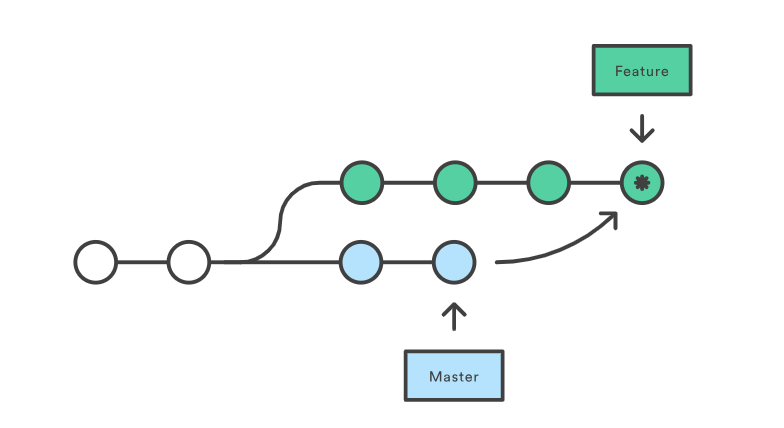
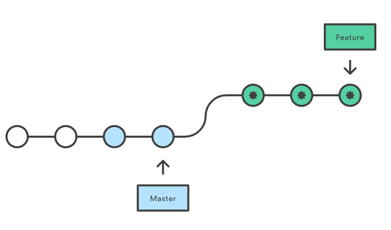

## Rebase vs Merge

### Git Merge

Слияние принимает содержимое ветки источника и объединяет их с целевой веткой. В этом процессе изменяется только целевая ветка. История исходных веток остается неизменной.

Плюсы:

- простота;
- сохраняет полную историю и хронологический порядок;
- поддерживает контекст ветки.

Минусы:

- история коммитов может быть заполнена (загрязнена) множеством коммитов;

### Git Rebase

В отличие от слияния, rebase перезаписывает историю, потому что она передает завершенную работу из одной ветки в другую. В процессе устраняется нежелательная история.

Плюсы:

- упрощает потенциально сложную историю
- упрощение манипуляций с единственным коммитом
- избежание слияния коммитов в занятых репозиториях и ветках

Минусы:

- сжатие фич до нескольких коммитов может скрыть контекст
- перемещение публичных репозиториев может быть опасным при работе в команде
- появляется больше работы
- для восстановления с удаленными ветками требуется принудительный пуш. Это приводит к обновлению всех веток, имеющих одно и то же имя, как локально, так и удаленно, и это ужасно.

### Когда использовать Rebase, а когда Merge?

В своей практике я выделил 2 случая, когда их лучше всего использовать.

1. Если вы работаете над фичей один — можете смело использовать Rebase. Напомню, он перезаписывает хэш коммитов => перезаписывает и создает новые, что может создать конфликты, если вы не предупредили своего напарника и работаете вместе.

2. Merge используем при влитии в master или когда в команде над одной фичей работают несколько человек в одной ветке, дабы престеречь друг друга от конфликтов
