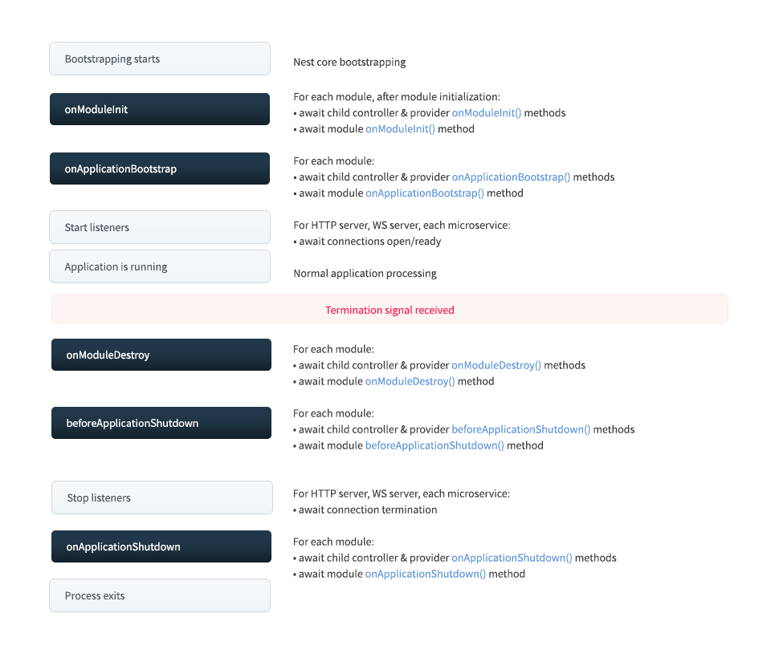
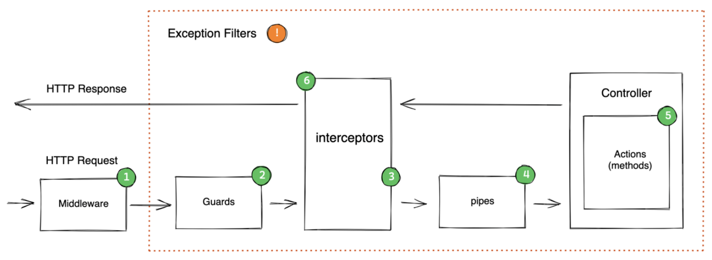

## <a name="application_lifecycle"></a>Жизненный цикл приложения в Nest.js (Lifecycle events)

Жизненный цикл можно разделить на 3 стадии: инициализация, выполнение (запуск) и завершение. События жизненного цикла возникают в процессе запуска и завершения работы приложения. NestJS вызывает методы хуков, зарегистрированные на `modules`, `injectables` и `controllers` для каждого события.



- **onModuleInit** — вызывается один раз после разрешения зависимостей модуля;

- **onApplicationBootstrap** — вызывается один раз после инициализации модулей, но до регистрации обработчиков установки соединения;

- **onModuleDestroy** — вызывается после получения сигнала о завершении работы (например, SIGTERM);

- **beforeApplicationShutdown** — вызывается после **onModuleDestroy**; после завершения (разрешения или отклонения промисов), все существующие подключения закрываются (вызывается app.close());

- **onApplicationShutdown** — вызывается после закрытия всех подключений (разрешения app.close()).

## <a name="request_lifecycle"></a>Request lifecycle в Nest.js



## <a name="injection_scopes"></a>Области внедрения / Injection scopes

Провайдер может иметь одну их следующих областей видимости:

- DEFAULT — в приложении используется единственный экземпляр провайдера. Жизненный цикл экземпляра совпадает с жизненным циклом приложения. "Провайдеры-одиночки" (singleton) инстанцируются при инициализации приложения;

- REQUEST — провайдер создаётся один раз для каждого запроса и существует на протяжении всего этого запроса. Экземпляр уничтожается сборщиком мусора после обработки запроса. _Например, если в ходе обработки запроса провайдер запрашивается несколько раз (например, в контроллере и в сервисе), **будет использован один и тот же экземпляр.**_

- TRANSIENT — провайдер создаётся каждый раз, когда он запрашивается, независимо от контекста (запрос, контроллер, сервис). _Например, если провайдер используется несколько раз в рамках одного запроса, **будет создано несколько экземпляров** — по одному для каждого места вызова._

### Влияние области внедрения на цепочку зависимостей

Область видимости "всплывает" вверх:

- Если какой-то провайдер в цепочке зависимостей имеет область видимости `Request`, все его потребители тоже будут иметь область `Request`.

- Провайдеры с областью `Transient` не влияют на цепочку.

## <a name="circular_dependency"></a>Циклическая зависимость / Circular dependency

Циклическая зависимость возникает, когда 2 класса зависят друг от друга. _Например, класс А зависит от класса Б, а класс Б зависит от класса А._

Циклическая зависимость в NestJS может возникнуть между модулями и провайдерами.

NestJS предоставляет 2 способа для разрешения циклических зависимостей:

- использование перенаправления ссылки (forward referencing);

- использование класса ModuleRef.

## <a name="lazy_module_loading"></a>Ленивая загрузка модулей

Ленивая загрузка может ускорить время запуска посредством загрузки только тех модулей, которые требуются.

Для еще большего ускорения запуска, другие модули могут загружаться асинхронно после "разогрева" такой функции.

NestJS предоставляет класс LazyModuleLoader для ленивой загрузки модулей, который внедряется в класс обычным способом:

```TypeScript
import { LazyModuleLoader } from '@nestjs/core'
const { LazyModule } = await import('./lazy.module')

@Injectable()
export class PostService {
  constructor(private lazyModuleLoader: LazyModuleLoader) {}
}
```

Далее модули загружаются с помощью такой конструкции:

```TypeScript
const { LazyModule } = await import('./lazy.module')
const moduleRef = await this.lazyModuleLoader.load(() => LazyModule)
```

- _Обратите внимание:_ в лениво загружаемых модулях и функциях не вызываются методы хуков жизненного цикла (lifecycle hooks methods).

- _Обратите внимание:_ ленивые модули не могут быть зарегистрированы в качестве глобальных модулей.
