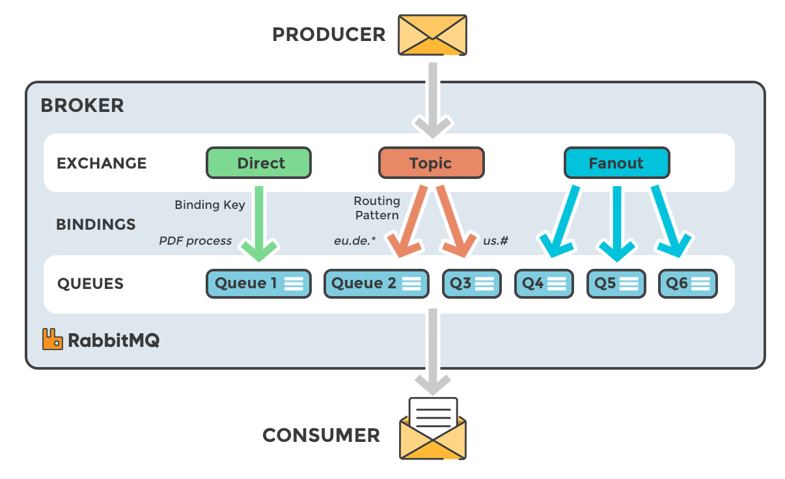
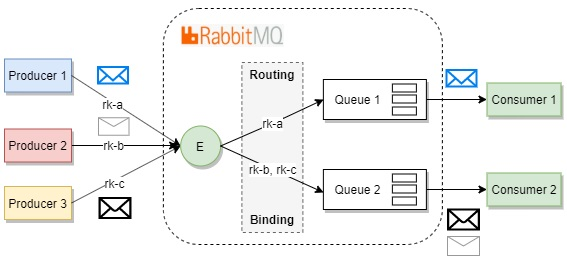
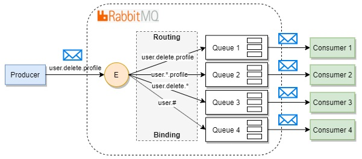
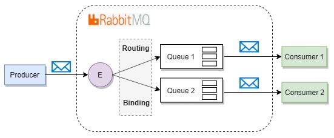
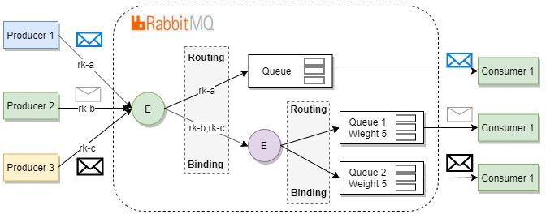

## <a name="rabbit"></a>Устройство RabbitMQ

RabbitMQ – это брокер сообщений. Он маршрутизирует собщения по протоколу AMQP.

Протокол AMQP вводит три понятия:

- **exchange** (обменник) — в неё отправляются сообщения. Обменник маршрутизирует сообщения в одну или несколько очередей, привязнных к нему.

- **queue** (очередь) — структура данных на диске или в оперативной памяти, которая хранит ссылки на сообщения и отдает копии сообщений **consumers** (потребителям). Одна очередь может использоваться несколькими потребителями.

- **binding** (привязка) — правило, которое сообщает точке обмена в какую из очередей эти сообщения должны попадать.



Как работает RabbitMQ под капотом:

1. Издатель отправляет сообщение определенному обменнику

2. Обменник, получив сообщение, маршрутизирует его в очередь/очереди.

3. Очередь хранит ссылку на это сообщение. Само сообщение хранится в оперативной памяти или на диске.

4. Как только потребитель готов получить сообщение из очереди, очередь создает копию сообщения и отправляет.

5. Потребитель получает сообщение и отправляет брокеру подтверждение.

6. Брокер, получив подтверждение, удаляет копию сообщения из очереди. Затем удаляет из оперативной памяти и с диска.

---

Для обмена информацией между клиентом и сервером используются каналы. Каналы создаются в рамках определенного подключения. Каждый канал изолирован от других каналов.

В синхронном случае не возможно выполнять следующую команду, пока не получен ответ.

## <a name="exchange_types"></a>Типы Exchange

**Exchange** — обменник. В него отправляются сообщения. **Exchange** распределяет сообщение в одну или несколько очередей. Он маршрутизирует сообщения в очередь на основе созданных связей (bindings) между ним и очередью.

У обменника есть несколько типов (правил) передачи сообщений.

### Direct Exchange

---

**Direct exchange** — сообщение попадает во все очереди, которые связаны с этим обменником аналогичным ключом маршрутизации.

Ключ маршрутизации — это строка. Поиск соответствия происходит при помощи проверки на эквивалентность.



### Topic Exchange

**Topic exchange** – аналогично **direct exchange** дает возможность осуществления выборочной маршрутизации путем сравнения ключа маршрутизации. Ключ задается по шаблону.

- (\*) может быть заменен на ровно 1 слово.
- (#) может быть заменен на любое количество слов.



Особенности:

- можно настроить, чтобы сообщения публиковались аналогично **direct exchange** или **fanout exchange**.

- шаблоны, которые используют \* намного быстрее #.

- **topic exchange** медленнее **direct exchange**.

### Fanout Exchange

---

**Fanout exchange** – все сообщения доставляются во все очереди, даже если в сообщении задан ключ маршрутизации.

Особенности:

- RabbitMQ не работает с ключами маршрутизации и шаблонами, что положительно влияет на производительность => это самый быстрый из возможных exchange.

- все потребители должны иметь возможность обрабатывать все сообщения.



### Комбинирование обменников (E2E)

---

Поведение всех обменников можно комбинировать при помощи связи **Exchange-to-Exchange** (комбинирование обменников не входит в спецификацию AMQP. Это расширение протокола со стороны RabbitMQ).



### **!!!Количество exchange и очередей должно быть минимально по сравнению с количеством маршрутов!!!**

### Пример создания Exchange:

```JavaScript
channel.ExchangeDeclare(
    exchange: "my_exchange",
    type: "direct",
    durable: "false",
    autoDelete: "false",
    arguments: null
);
```

- exchange — название обменника. Название должно быть уникальным.

- type — тип обменника.

- durable — если установить true, то **exchange** будет являться постоянным. Он будет храниться на диске и сможет пережить перезапуск сервера/брокера. Если значение false, то **exchange** является временным и будет удаляться, когда сервер/брокер будет перезагружен.

- autoDelete — автоматическое удаление. **Exchange** будет удален, когда будут удалены все связанные с ним очереди.

- arguments — необязательные аргументы. Чаще всего, через аргументы задают.

- alternative exchange (альтернативный обменник). Если сообщение не может пройти по первоначальному маршруту, ее можно отправить в альтернативный (запасной) обменник.

## <a name="queue"></a>Очереди в RabbitMQ

**Queue** (очередь) — структура данных на диске или в оперативной памяти, которая хранит ссылки на сообщения и отдает их копии consumers (потребителям).

### Временные очереди

---

Если очередь создается с параметром `autoDelete`, то такая очередь обретает способность автоматически удалять себя.
Такие очереди обычно создаются в момент подключения первого клиента и удаляются в момент, когда все клиенты отсоединились.

Если создание очереди происходит с установленным параметром `exclusive`, то такая очередь разрешает подключаться только одному потребителю и удаляется если закроется канал. До тех пор пока канал не закроется, клиент может отключаться/подключаться, но только в рамках того же самого соединения.
Если параметр `exclusive` установлен, то параметр `autoDelete` не имеет никакого эффекта.

Особенности:

- при кратковременном разрыве связи мы будем терять сообщения, которые ещё не успели дойти до потребителя.

- можно поймать феномен `binding churn`. Феномен возникает, когда количество операций по созданию/удалению очередей и привязок достигает очень больших значений.

### Постоянные очереди

---

Если создание очереди происходит с установленным параметром `durable`, то такая очередь сохраняет свое состояние и восстанавливается после перезапуска сервера/брокера.

### Highly Available очереди

---

Highly Available очереди требуют кластерной среды RabbitMQ. В кластерном режиме вся информация об обменниках, очередях, привязках и потребителях будет скопирована на все узлы.

Когда сообщение публикуется в какую-то Highly Available очередь, оно хранится на каждом узле, относящемуся к Highly Available очереди. После того как сообщение потребляется на каком-то из узлов, все копии этого сообщения будут удалены на других узлах.

```JavaScript
channel.QueueDeclare(
    queue: "my_queue",
    durable: false,
    exclusive: false,
    autoDelete: false,
    arguments: null
);
```

## <a name="bindings"></a>Связи в RabbitMQ

**Binding** (привязка) — правило, которое сообщает обменнику в какую из очередей должны попадать сообщения.

```JavaScript
channel.QueueBind(
    queue: queueName,
    exchange: "my_exchange",
    routingKey: "my_key",
    arguments: null
);
```
