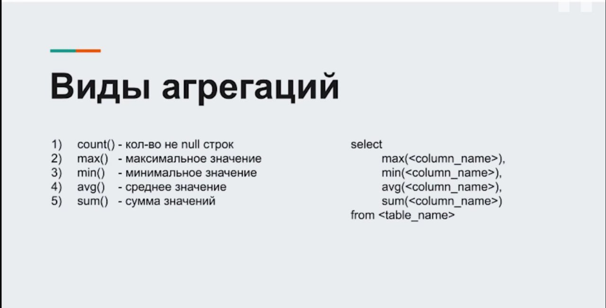
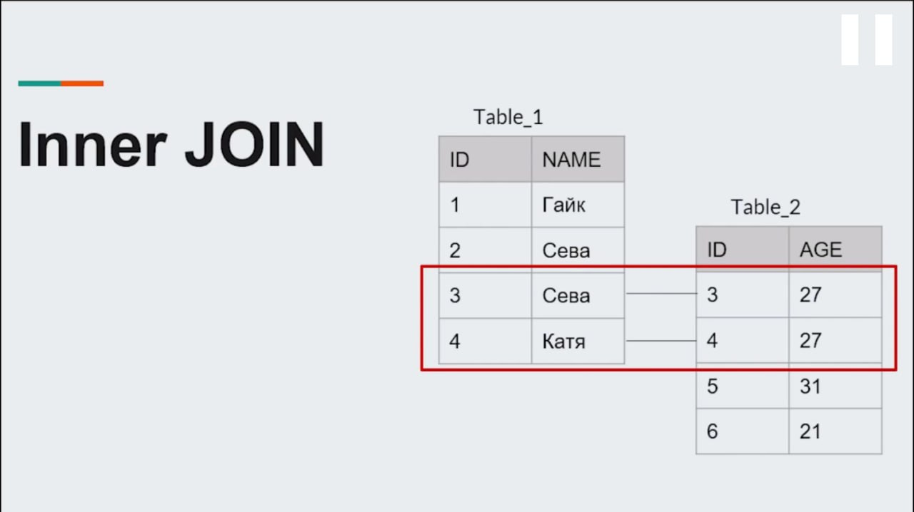
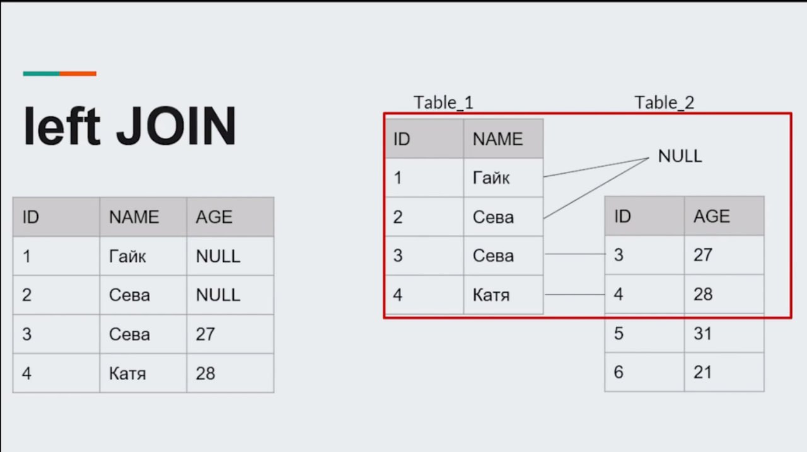
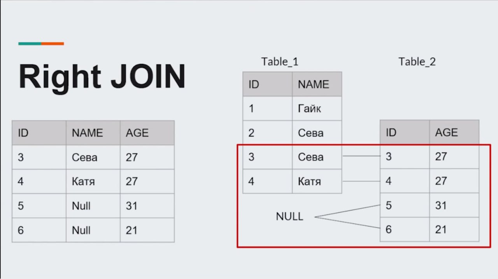
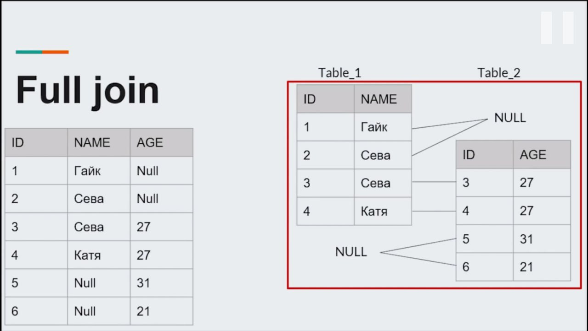
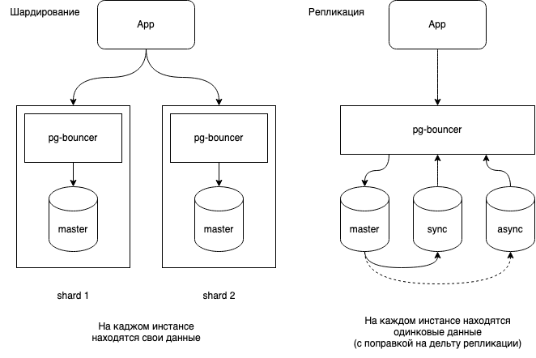

## <a name="indexies"></a>Индексы

Индексы — это специальные поисковые таблицы (lookup tables), которые используются движком БД в целях более быстрого извлечения данных.

Индексы ускоряют работу инструкции `SELECT` и предложения `WHERE`, но замедляют работу инструкций `UPDATE` и `INSERT`.

## <a name="having_vs_where"></a>Having vs Where

`WHERE` используется для фильтрации данных перед их группировкой или агрегированием и применяется в операторах `SELECT`, `UPDATE` и `DELETE`

`HAVING` используется для фильтрации данных после их группировки или агрегирования и применяется только с оператором `SELECT`.

## <a name="group_by"></a>Что такое GROUP BY

`GROUP BY` – это оператор, используемый для группировки строк с одинаковыми значениями.

`GROUP BY` требует, чтобы в операторе `SELECT` использовалась хотя бы одна агрегатная функция, например `SUM`, `COUNT`, `AVG`,` MAX` или `MIN`. За оператором GROUP BY обычно следует имя (имена) столбца (столбцов), по которым необходимо сгруппировать данные.

```SQL
SELECT Product, SUM([Sales Amount]) as TotalSales
FROM Sales
GROUP BY Product;
```



## <a name="inner_outer_joins"></a>В чем разница между внутренним и внешним соединением? (JOIN)

Внутреннее соединение возвращает только совпадающие строки из обеих таблиц на основе условия соединения.

```SQL
SELECT A.column1, B.column2
FROM A
INNER JOIN B
ON A.C = B.C;
```



Внешнее соединение возвращает все строки из одной таблицы и совпадающие строки из другой таблицы. Если во второй таблице нет совпадающих строк, результат будет содержать NULL-значения для всех столбцов этой таблицы. Внешние соединения также делятся на левое внешнее (`LEFT JOIN`), правое внешнее (`RIGHT JOIN`) и полное внешнее соединение (`FULL JOIN`).

```SQL
SELECT A.column1, B.column2
FROM A
LEFT OUTER JOIN B
ON A.C = B.C;
```







## <a name="delete_vs_truncate"></a>DELETE vs TRUNCATE

Оператор `DELETE` используется для удаления определенных строк из таблицы на основе условия, указанного в предложении `WHERE`.

Оператор `TRUNCATE` используется для удаления всех строк из таблицы за один раз

## <a name="triggers"></a>Что такое триггеры?

Триггеры — это команды, которые запускаются только при определенных событиях. Этими событиями являются команды на добавление, изменение или удаление данных в таблице (`INSERT`, `UPDATE`, `DELETE`).

Ключевые слова `BEFORE` и `AFTER` определяют момент запуска триггера: `BEFORE` означает запуск до выполнения события, а `AFTER` — после него. Так с их помощью получается поддерживать в целостности данных в базе и управлять сложной бизнес-логикой в системе.

Примеры:

```SQL
CREATE TRIGGER имя_триггера
ON таблица/представление
AFTER/INSTEAD OF INSERT/UPDATE/DELETE
AS
BEGIN
  -- Тело триггера (выражения SQL)
END;
```

```SQL
CREATE TRIGGER before_order_insert
ON orders
BEFORE INSERT
AS
BEGIN
  -- Проверка наличия товара на складе
  IF (SELECT quantity FROM products WHERE id = NEW.product_id) <= 0 THEN
    SIGNAL SQLSTATE '45000' SET MESSAGE_TEXT = 'Недостаточно товара на складе';
  END IF;
END;
```

## <a name="stored_procedure"></a>Что такое хранимые процедуры?

**Хранимая процедура** - это скомпилированный набор SQL-предложений, сохраненный в базе данных, как именованный объект и выполняющийся, как единый фрагмент кода. Хранимые процедуры могут принимать и возвращать параметры. Что-то наподобии `namespace` в TypeScript

Пример создания процедуры:

```SQL
USE productsdb;
GO
CREATE PROCEDURE ProductSummary AS
BEGIN
    SELECT ProductName AS Product, Manufacturer, Price
    FROM Products
END;
```

Выполнение процедуры:

```SQL
EXEC ProductSummary;
```

Удаление процедуры:

```SQL
DROP PROCEDURE ProductSummary
```

## <a name="migrations"></a>Что такое миграции базы данных?

**Миграция** — обновление структуры базы данных от одной версии до другой (обычно более новой).

## <a name="views"></a>Представления (views) в базах данных?

**Представление** – виртуальную таблицу. В эту виртуальную таблицу как бы сохраняется результат запроса. Создается представление через команду `CREATE VIEW`.

Таблица виртуальная потому, что на самом деле ее нет в базе данных. В такую таблицу не получится вставить данные, обновить их или удалить. Можно только посмотреть хранящиеся в ней данные, сделать из нее выборку.

С другой стороны, если вы вносите изменения в реальные таблицы, они будут отражены и в виртуальных (представлениях).

## <a name="sharding_&_replication"></a>Шардирование и Репликация

**Шардинг (или шардирование)** — это разделение хранилища на несколько независимых частей, шардов (от англ. shard — осколок).

**Репликация** - Не путайте шардирование с репликацией, в случае которой выделенные экземпляры базы данных являются не составными частями общего хранилища, а копиями друг друга.



## <a name="transactions"></a>Транзакции

Транзакция — это набор операций по работе с базой данных (БД), объединенных в одну атомарную пачку. Все операции в транзакции завершаются успешно, либо ни одна из них не применяется к базе данных.

## <a name="transaction_isolation"></a>Уровни изоляции транзакций

[Всего есть 4 основных уровня изоляции:](https://www.youtube.com/watch?v=yVlCjzJAOOo&ab_channel=ListenIT)

- READ UNCOMMITTED

- READ COMMITTED

- REPEATABLE READ

- SERIALIZABLE

### READ UNCOMMITTED

Транзакция может видеть результаты других транзакций, даже если они ещё не закоммичены.

В следствии такого вида изолированности, проявляются аномалии: **Dirty Read (грязное чтение)**, **Fuzzy Read (неповторяющееся чтение)**, **Phantom Read (фантомное чтение)**

### READ COMMITTED

Транзакция может читать только те изменения в других параллельных транзакциях, которые уже были закоммичены.

В следствии такого вида изолированности, проявляются аномалии: **Fuzzy Read (неповторяющееся чтение)**, **Phantom Read (фантомное чтение)**

### REPEATABLE READ

Пока транзакция не завершится, никто параллельно не может изменять или удалять строки, которые транзакция уже прочитала

В следствии такого вида изолированности, проявляются аномалии: **Phantom Read (фантомное чтение)**

### SERIALIZABLE

Блокирует любые действия, пока запущена транзакция (самый тяжелый и медленный для обработки запросов уровень)

---

### Виды часто встречающихся аномалий

- **Dirty Read (грязное чтение)** - данные, которые я прочитал, кто-то может откатить ещё до того, как я завершу свою транзакцию.

- **Fuzzy Read (неповторяющееся чтение)** - данные, которые я прочитал, кто‑то может изменить ещё до того, как я завершу свою транзакцию,

- **Phantom Read (фантомное чтение)** - ряд данных, которые я прочитал, кто‑то может изменить до того, как я завершу свою транзакцию.

## <a name="acid"></a>ACID

ACID - четыре ключевых свойства, обеспечивающих надежность базы данных:

- Атомарность (`Atomicity`) - транзакция должна быть выполнена в целом или не выполнена в общем.

- Согласованность (`Consistency`) - гарантирует, что транзакция не может разрушить взаимной согласованности данных.

- Изолированность (`Isolation`) - транзакции обрабатываются изолированно друг от друга.

- Долговечность (`Durability`) - устойчивость к ошибкам — если транзакция завершена успешно, то те изменения в данных, которые были ею произведены, не могут быть потеряны ни при каких обстоятельствах.
