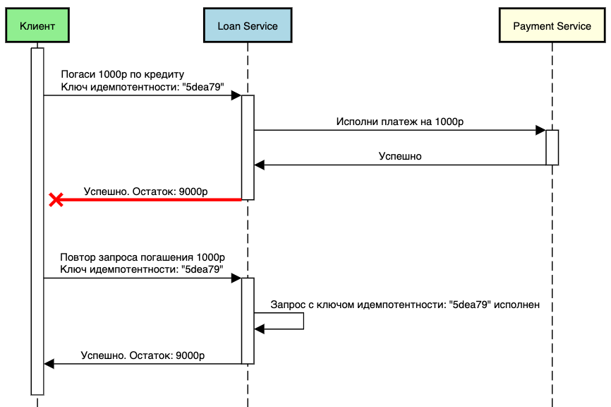

## <a name="methods"></a>Методы

- GET — Запрос на получение ресурсов

- HEAD — Запрос на передачу ресурса, но сам ресурс в ответе не передается, только заголовки. Аналогичен `GET`. Отсутствует тело.

- POST — Создание ресурса

- PUT — Обновление ресурса (всех его полей)

- PATCH — Аналогично `PUT`, только обновляет часть ресурса

- DELETE — Удаление ресурса

- CONNECT — Установка соединение с сервером.

- OPTIONS — Запрос поддерживаемых HTTP методов или параметров соединения для конкретного ресурса

- TRACE — Возвращает полученный запрос так, что клиент может увидеть, какую информацию промежуточные серверы добавляют или изменяют в запросе.

### Ответ HTTP

Ответ HTTP, как и запрос, состоит из трех частей:

- Статус ответа

- Заголовки **(не обязательно)**

- Тело сообщения **(не обязательно)**

Пример:

```
HTTP/1.1 200 ОК
Content-Type: text/html; charset=UTF-8
Content-Length: 5161

Текст Web-страницы...
```

## <a name="idempotency"></a>Идемпотентность запроса

Идемпотентность запроса — обеспечение возможности многократного вызова запроса с гарантией того, что состояние системы изменится только один раз.

Чтобы реализовать такую механику, нужно воспользоваться ключом идемпотентности — это уникальное значение, которое создаётся на стороне клиента и отправляется на сервер вместе с запросом. Ключ является инструментом для идентификации и контроля за повторными запросами. Для него рекомендуется использовать формат UUID.

[Подробнее в статье](https://habr.com/ru/companies/domclick/articles/779872/)




